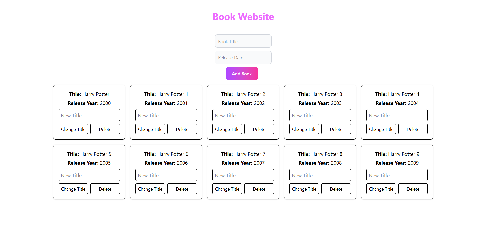

# 📘 React + Django CRUD Application

This is a simple **CRUD (Create, Read, Update, Delete)** application built using **Vite + React** on the frontend and **Django + Django REST Framework** on the backend.

It is designed for **learning and teaching purposes**, demonstrating how to integrate React with Django REST API in a clean and organized manner.

---

## ✨ Features

- Create, Read, Update, Delete records
- REST API using Django REST Framework
- Clean and modular frontend using Vite + React
- CORS-enabled backend for smooth integration

---

## ⚙️ Tech Stack

**Frontend:**
- [React](https://reactjs.org/)
- [Vite](https://vitejs.dev/)
- [Tailwind CSS](https://tailwindcss.com/)

**Backend:**
- [Django](https://www.djangoproject.com/)
- [Django REST Framework](https://www.django-rest-framework.org/)
- [SQLite3](https://www.sqlite.org/)

---

## 🏠 App Homepage

